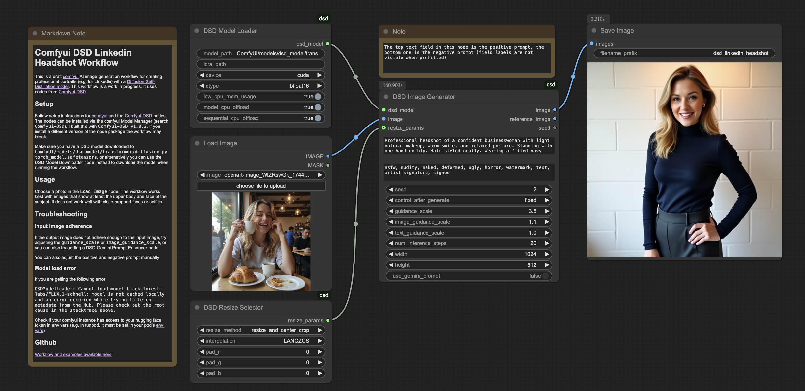

# Comfyui DSD Linkedin Headshot Workflow

This is a draft [comfyui](https://github.com/comfyanonymous/ComfyUI) AI image generation workflow for creating professional portraits (e.g. for Linkedin) with a [Diffusion Self-Distillation model](https://huggingface.co/primecai/dsd_model). This workflow is a work in progress.
It uses nodes from [Comfyui-DSD](https://github.com/irreveloper/ComfyUI-DSD)

## Setup

Follow setup instructions for [comfyui](https://github.com/comfyanonymous/ComfyUI) and the [Comfyui-DSD](https://github.com/irreveloper/ComfyUI-DSD) nodes. The nodes can be installed via the comfyui Model Manager (search `Comfyui-DSD`). I built this with `Comfyui-DSD v1.0.2`. If you install a different version of the node package the workflow may be broken or incomplete.

Make sure you have a DSD model downloaded to `ComfyUI/models/dsd_model/transformer/diffusion_pytorch_model.safetensors`, or alternatively you can use the DSD Model Downloader node instead to download the model when running the workflow.

## Usage

Choose a photo in the `Load Image` node. The workflow works best with images that show at least the upper body and face of the subject. It does not work well with close-cropped faces or selfies.

## Troubleshooting

### Input image adherence

If the output image does not adhere enough to the input image, try adjusting the `guidance_scale` or `image_guidance_scale`, or you can also try adding a DSD Gemini Prompt Enhancer node

You can also adjust the positive and negative prompt manually

### Model load error

If you are getting the following error

`DSDModelLoader:
Cannot load model black-forest-labs/FLUX.1-schnell: model is not cached locally and an error occurred while trying to fetch metadata from the Hub. Please check out the root cause in the stacktrace above.`

Check if your comfyui instance has access to your hugging face token in env vars (e.g. in runpod, it must be set in your pod's [env vars](https://docs.runpod.io/serverless/workers/vllm/environment-variables))

## Example Workflow Result

## Github

[Workflow and examples available here](https://github.com/keighleymcf/comfyui-dsd-linkedin-headshot-workflow)
