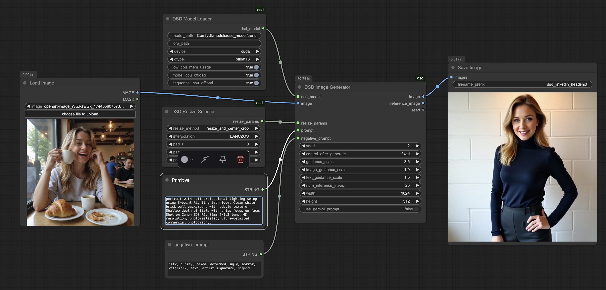

# Comfyui DSD Linkedin Headshot Workflow

This is a draft [comfyui](https://github.com/comfyanonymous/ComfyUI) AI image generation workflow for creating professional portraits (e.g. for Linkedin) with a [Diffusion Self-Distillation model](https://huggingface.co/primecai/dsd_model). This workflow is a work in progress.
It uses nodes from [Comfyui-DSD](https://github.com/irreveloper/ComfyUI-DSD)

## Setup

To use, make sure you have a DSD model downloaded to ComfyUI/models/dsd_model/transformer/diffusion_pytorch_model.safetensors, or alternatively you can use the DSD Model Downloader node instead to download the model when running the workflow.

## Usage

Choose a photo in the `Load Image` node. The workflow works best with images that show at least the upper body and face of the subject. It does not work well with close-cropped faces or selfies.

If the output image does not adhere enough to the input image, try adjusting the `guidance_scale` or `image_guidance_scale`, or you can also try adding a DSD Gemini Prompt Enhancer node

You can also adjust the positive and negative prompt manually

## Example Workflow Result

